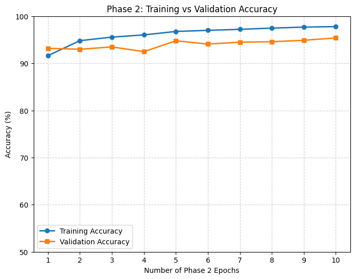
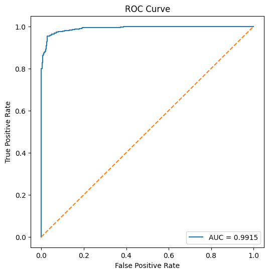
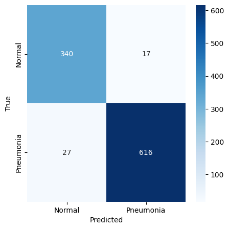
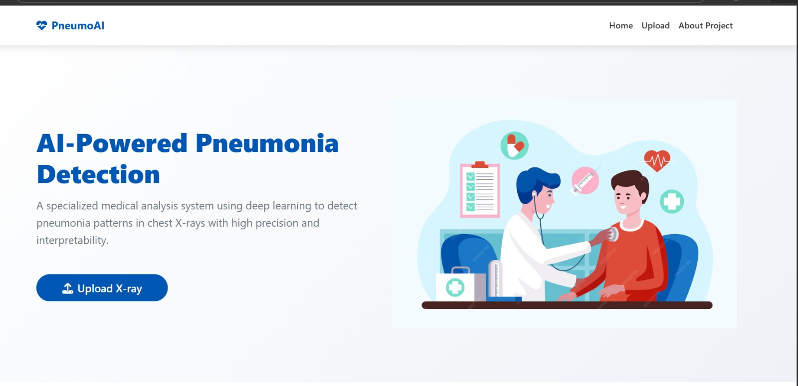
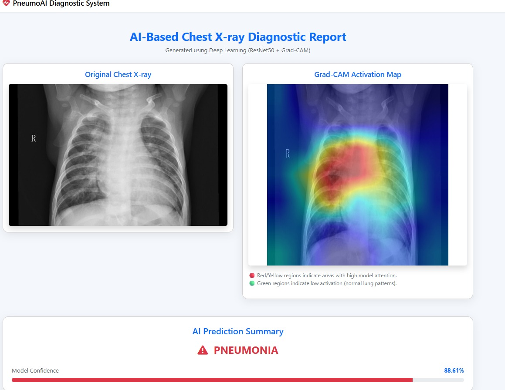

# 🫁 PNEUMONIA DETECTION FROM CHEST X-RAY IMAGES USING DEEP LEARNING MODELS

**Batch ID:** Batch-10
**Course:** Undergraduate Major Project – 2026
**Institution:** PACE Institute of Technology and Sciences (Autonomous)

---

## 👥 Team Members

| Name               | Roll Number | GitHub |
| :----------------- | :---------- | :----- |
| R. Susmitha        | 22KQ1A6121  | —      |
| P. Kavya           | 22KQ1A6117  | —      |
| A. Karthik         | 22KQ1A6130  | —      |
| K. Nirmal Yaswanth | 22KQ1A6143  | —      |
| J. Assan           | 23KQ5A6105  | —      |

**Project Guide:**
Mrs. N. Haritha Patel
Assistant Professor, Department of Artificial Intelligence and Machine Learning

---

## 🚀 Project Overview

### Problem Statement

Pneumonia is one of the leading causes of respiratory-related deaths worldwide, particularly among children and elderly patients. Diagnosis using chest X-ray imaging requires expert radiological interpretation, which may not always be available in resource-limited healthcare environments.

Manual analysis may also introduce delays and observer variability. Therefore, this project proposes an **Artificial Intelligence–based automated diagnostic assistant** capable of detecting pneumonia from chest X-ray images while providing visual explanations using Grad-CAM to improve transparency and clinical trust.

---

### Key Objective

The primary objective of this project is to develop an **Explainable Artificial Intelligence (XAI) based pneumonia detection system** using deep learning techniques capable of accurately classifying chest X-ray images as:

* Normal
* Pneumonia

The system achieves approximately **95%+ diagnostic accuracy** while generating Grad-CAM heatmaps that highlight lung regions influencing predictions, improving interpretability for medical practitioners.

---

## 📊 Dataset Information

### Dataset Used

Chest X-ray Pneumonia Dataset (Kermany Dataset)

**Kaggle Source:**
https://www.kaggle.com/datasets/paultimothymooney/chest-xray-pneumonia

### Description

The dataset contains pediatric chest X-ray images categorized into:

* Normal
* Pneumonia

Dataset Characteristics:

* Approximately **5,800+ X-ray images**
* Organized into training, validation, and testing folders
* Clinically labeled medical images

Additional Improvements:

* Added **700 Normal images** to reduce class imbalance
* Dataset split using **70–15–15 rule**

  * Training
  * Validation
  * Testing

---

### Preprocessing Steps

* Images resized to **224 × 224 pixels** (ResNet50 input size)
* Normalization using `preprocess_input()`
* Data augmentation applied:

  * Rotation
  * Zoom
  * Horizontal flipping
  * Width and height shifting
* Batch image generators used for efficient GPU training
* Dataset separation maintained to prevent data leakage

Dataset Drive Link:
https://drive.google.com/drive/folders/1FMSO0HNpe5z7Z6t_t1_-TPoI8LXXR025

Trained Model File:
https://drive.google.com/file/d/1ap7uBFOPukiqPYAxKPdQQjVoau1KUJzY

---

## 🧠 Model Architecture & Methodology

### Algorithm / Model

A **ResNet50-based Convolutional Neural Network (CNN)** using transfer learning was implemented for pneumonia classification.

Training Strategy:

Phase 1 — Feature Extraction

* Backbone layers frozen
* Classification layers trained

Phase 2 — Fine Tuning

* Deep layers unfrozen
* Medical feature adaptation improved

---

### Framework

The system was developed using:

* TensorFlow
* Keras
* Python
* Google Colab GPU Environment

Evaluation Methods:

* Accuracy
* ROC-AUC Analysis
* Confusion Matrix
* Grad-CAM Explainability

---

## 📈 Results & Performance

### Model Performance

| Metric    | Value |
| :-------- | :---- |
| Accuracy  | 95.6% |
| Precision | 98.3% |
| Recall    | 95.1% |
| F1 Score  | 96.7% |
| ROC-AUC   | 0.99  |

### Training Performance



### ROC Curve



### Confusion Matrix



---

## 🔬 Explainable AI — Grad-CAM

To enhance medical interpretability, Grad-CAM visualization was integrated into the system.

Grad-CAM highlights:

* 🔴 Red / Yellow → Highly important infected lung regions
* 🟢 Blue / Green → Normal lung structures

Workflow:

Original X-ray
→ Model Prediction
→ Infection Region Highlighted

This improves clinical reliability and model transparency.

---

## 🌐 Web Deployment

The trained model is deployed using:

* Flask Framework
* HTML5 + Bootstrap Interface
* Grad-CAM Visualization Pipeline

### System Workflow

Upload Chest X-ray
↓
Model Prediction
↓
Confidence Score
↓
Grad-CAM Visualization
↓
Diagnostic Report

---

## 🚀 Installation

### Clone Repository

```
git clone https://github.com/PACE-ITS/major-project-batch-10.git
```

### Install Dependencies

```
pip install -r requirements.txt
```

### Run Application

```
python app.py
```

## 📷 Project Output




---

## 🔮 Future Improvements

* Multi-disease lung abnormality detection
* RSNA dataset generalization
* Cloud-based deployment
* Doctor feedback integration
* Real-time hospital integration

---

## 📜 License

This project is developed for academic and research purposes.

---

## 🙏 Acknowledgment

We acknowledge publicly available medical imaging datasets and open-source deep learning frameworks that supported this research work.
